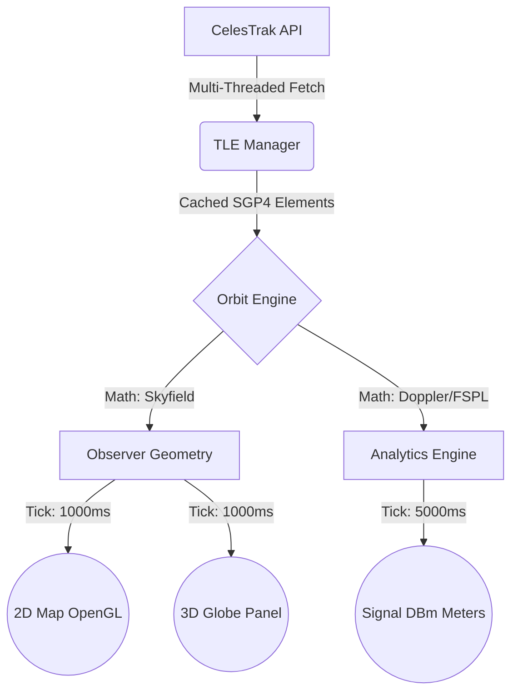

<div align="center">
  
  
  
  

  <h1>🛰️ ORBITAL COMMAND v3</h1>
  <p><b>Advanced 2D/3D Satellite Tracking, Link Budget Analysis, and Telemetry Engine</b></p>
</div>

---

Orbital Command is an extremely powerful, open-source Python application designed for tracking tens of thousands of Earth-orbiting satellites in real-time. Built entirely on top of PyQt5, PyOpenGL, and the Skyfield orbital dynamics library, this tool is capable of visualizing everything from the ISS down to microscopic debris in rich, high-performance interactive views.

## 🌟 Key Features

### 🌍 Real-Time 3D & 2D Visualization
- **Native 3D Globe**: Built with PyOpenGL. Features atmospheric glow shaders, coverage cones, orbital rings, and dynamic wireframes.
- **Batch-Optimized 2D World Map**: A highly optimized PyQt painter that smoothly renders 5000+ objects simultaneously at 60 FPS utilizing `QPainterPath` batch grouping.
- **Heatmaps & Orbit Filters**: Switch the globe views to heatmap density tracking, view-by-orbit (LEO/MEO/GEO), or view-by-velocity.

### 📡 Deep Signal Analytics & Link Budgets
- **Real-Time Slant Range**: Dynamically measures the distance from your ground observer base to any active satellite.
- **Link Budgets (dBm)**: Instantly computes estimated Free Space Path Loss (FSPL) and SNR across 13 major radio bands (VHF, UHF, S-Band, Ku-Band).
- **Doppler Shift Calculation**: Determines Range Rate (km/s) and frequency shifts for active radio communication.

### 📊 Comparative Intelligence
- **Comparison Data Grid**: A 4-way spreadsheet view predicting the stats, velocity, and communication footprint of different satellites simultaneously.
- **Data-Mining & Scraping**: Automatically fetches, sorts, and caches 40+ unique element sets from CelesTrak using a Lightning-Fast Multi-Threaded asynchronous fetcher.
- **24-Hour Pass Timeline**: Predicts when a selected satellite will achieve AOS (Acquisition of Signal) locally based on your exact observer coordinates.

---

## 🛠️ Installation

**1. Clone the repository**
```bash
git clone https://github.com/Pl4yer-ONE/orbital-command.git
cd orbital-command
```

**2. Setup Virtual Environment & Install Dependencies**
```bash
python3 -m venv venv
source venv/bin/activate
pip install -r requirements.txt
```

*(Note: On Debian/Ubuntu systems, ensure you have system OpenGL installed (`sudo apt install libglu1-mesa`) for the 3D globe to render natively).*

**3. Launch**
```bash
./launch.sh
```
or 
```bash
python3 main.py
```

---

## 📚 Architectural Overview

The application features a fully non-blocking, asynchronous GUI paired with a headless math engine. For a deep-dive into how the threads parse CelesTrak data and feed the Qt timers, see the full specification in [ARCHITECTURE.md](ARCHITECTURE.md).



## 🤝 Contributing
Found a bug or want to add a feature? Orbital Command is entirely open source! Feel free to open a Pull Request.

**License**: MIT 
